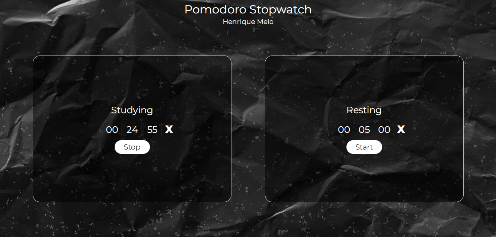
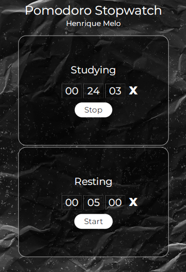

# Pomodoro Stopwatch

> Information:

Double stopwatch, made for performing the Pomodoro study technique. You can use the suggested time or customize it. You can reset it at any time and you don't have to worry about resetting it at the end of the countdown, as the time set before clicking the "start" button will automatically reset. The timer emits an alarm at the end of the countdown, followed by an alert. It only accepts numbers in all entries, and does not allow the user to put values above fifty-nine in the minutes and seconds entries.

## Layout Desktop:

## Layout Mobile:

## 🛠 Technologies:

- HTML
- CSS
- JavaScript

## 📲 Contact:

henriquemelo0983@gmail.com